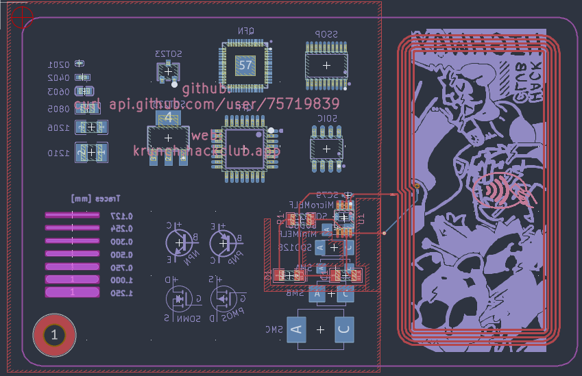
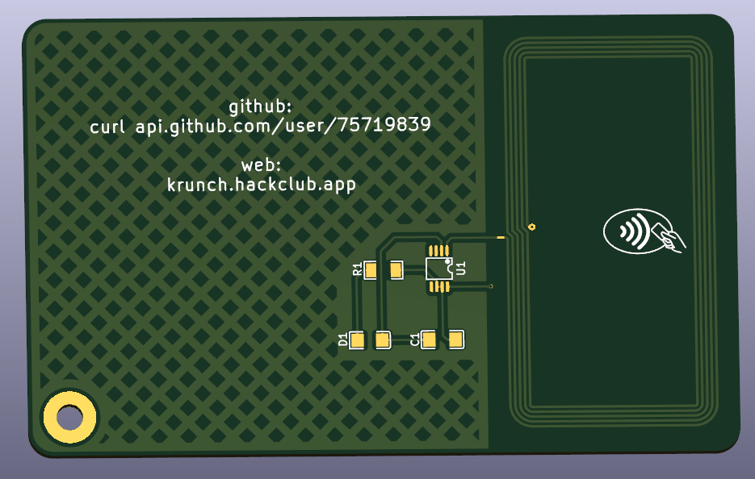

# krunchcard
A card-sized NFC business card

# About
hello 

# Images

Schematic (click to expand)

| Schematic |
|-----------|
|  |

| PCB | 3D Preview | Case |
|-----|------------|------|
|  |  |  |
| |  | |

# Case

 

# BOM
| Qty | Item                               | Notes                             | Cost (GBP) | URL                                                                                  |
|-----|------------------------------------|-----------------------------------|------------|--------------------------------------------------------------------------------------|
| 1   | cat                                | any type                       | 0.00       | [LCSC](https://lcsc.com)                 |

